## Importing CSV marketing Data

```r
m_date <- read.csv("MMA marketing_data_sample.csv",header = TRUE)
```
# Getting started with Data Pre-porcessing 

# Exploratory Data Analysis

```
##    age          job  marital                   k default housing    loan
## 1   30  blue-collar  married            basic.9y      no     yes      no
## 2   39     services   single         high.school      no      no      no
## 3   25     services  married         high.school      no     yes      no
## 4   38     services  married            basic.9y      no unknown unknown
## 5   47       admin.  married   university.degree      no     yes      no
## 6   32     services   single   university.degree      no      no      no
## 7   32       admin.   single   university.degree      no     yes      no
## 8   41 entrepreneur  married   university.degree unknown     yes      no
## 9   31     services divorced professional.course      no      no      no
## 10  35  blue-collar  married            basic.9y unknown      no      no
##      contact month day_of_week duration campaign pdays previous    poutcome
## 1   cellular   may         fri      487        2   999        0 nonexistent
## 2  telephone   may         fri      346        4   999        0 nonexistent
## 3  telephone   jun         wed      227        1   999        0 nonexistent
## 4  telephone   jun         fri       17        3   999        0 nonexistent
## 5   cellular   nov         mon       58        1   999        0 nonexistent
## 6   cellular   sep         thu      128        3   999        2     failure
## 7   cellular   sep         mon      290        4   999        0 nonexistent
## 8   cellular   nov         mon       44        2   999        0 nonexistent
## 9   cellular   nov         tue       68        1   999        1     failure
## 10 telephone   may         thu      170        1   999        0 nonexistent
##    emp.var.rate cons.price.idx cons.conf.idx euribor3m nr.employed  y
## 1          -1.8         92.893         -46.2     1.313      5099.1 no
## 2           1.1         93.994         -36.4     4.855      5191.0 no
## 3           1.4         94.465         -41.8     4.962      5228.1 no
## 4           1.4         94.465         -41.8     4.959      5228.1 no
## 5          -0.1         93.200         -42.0     4.191      5195.8 no
## 6          -1.1         94.199         -37.5     0.884      4963.6 no
## 7          -1.1         94.199         -37.5     0.879      4963.6 no
## 8          -0.1         93.200         -42.0     4.191      5195.8 no
## 9          -0.1         93.200         -42.0     4.153      5195.8 no
## 10          1.1         93.994         -36.4     4.855      5191.0 no
```


```r
#Structure of the dataset
str(m_date)
```

```
## 'data.frame':	4100 obs. of  21 variables:
##  $ age           : int  30 39 25 38 47 32 32 41 31 35 ...
##  $ job           : chr  "blue-collar" "services" "services" "services" ...
##  $ marital       : chr  "married" "single" "married" "married" ...
##  $ k             : chr  "basic.9y" "high.school" "high.school" "basic.9y" ...
##  $ default       : chr  "no" "no" "no" "no" ...
##  $ housing       : chr  "yes" "no" "yes" "unknown" ...
##  $ loan          : chr  "no" "no" "no" "unknown" ...
##  $ contact       : chr  "cellular" "telephone" "telephone" "telephone" ...
##  $ month         : chr  "may" "may" "jun" "jun" ...
##  $ day_of_week   : chr  "fri" "fri" "wed" "fri" ...
##  $ duration      : int  487 346 227 17 58 128 290 44 68 170 ...
##  $ campaign      : int  2 4 1 3 1 3 4 2 1 1 ...
##  $ pdays         : int  999 999 999 999 999 999 999 999 999 999 ...
##  $ previous      : int  0 0 0 0 0 2 0 0 1 0 ...
##  $ poutcome      : chr  "nonexistent" "nonexistent" "nonexistent" "nonexistent" ...
##  $ emp.var.rate  : num  -1.8 1.1 1.4 1.4 -0.1 -1.1 -1.1 -0.1 -0.1 1.1 ...
##  $ cons.price.idx: num  92.9 94 94.5 94.5 93.2 ...
##  $ cons.conf.idx : num  -46.2 -36.4 -41.8 -41.8 -42 -37.5 -37.5 -42 -42 -36.4 ...
##  $ euribor3m     : num  1.31 4.86 4.96 4.96 4.19 ...
##  $ nr.employed   : num  5099 5191 5228 5228 5196 ...
##  $ y             : chr  "no" "no" "no" "no" ...
```
####  Check for missing values in the dataset


```r
sum(is.na(m_date))
```

```
## [1] 0
```


###Checking for outliers


```r
#Box plot for visualising outliers
boxplot(m_date$age)
```


```r
#ggplot(m_date,mapping = aes(age)) + geom_boxplot()
```


```r
boxplot(m_date$duration)
```

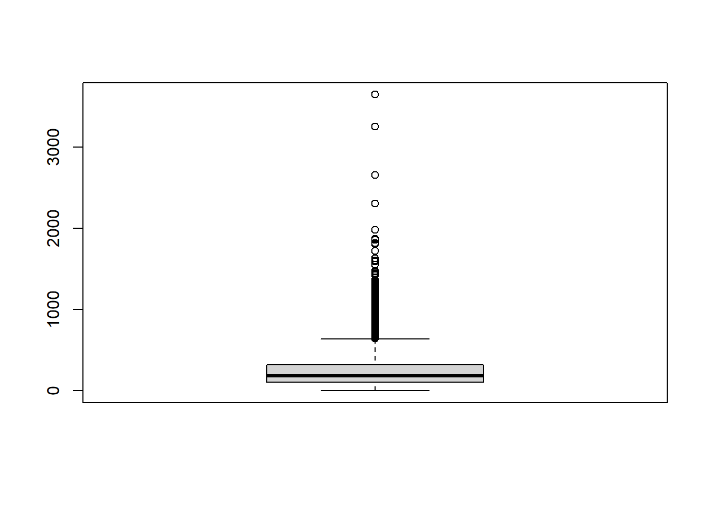


```r
boxplot(m_date$pdays)
```

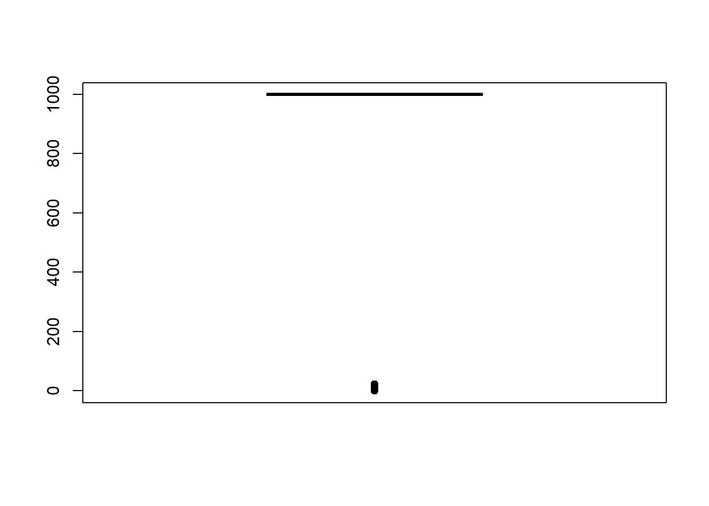
#### Removing the 999 number 

```r
m_date <- mutate(m_date,pdays5 = ifelse(pdays == 999,'',pdays))
```


```r
m_date$pdays5 <- as.numeric(m_date$pdays5)
```

```r
boxplot(m_date$pdays5)
```

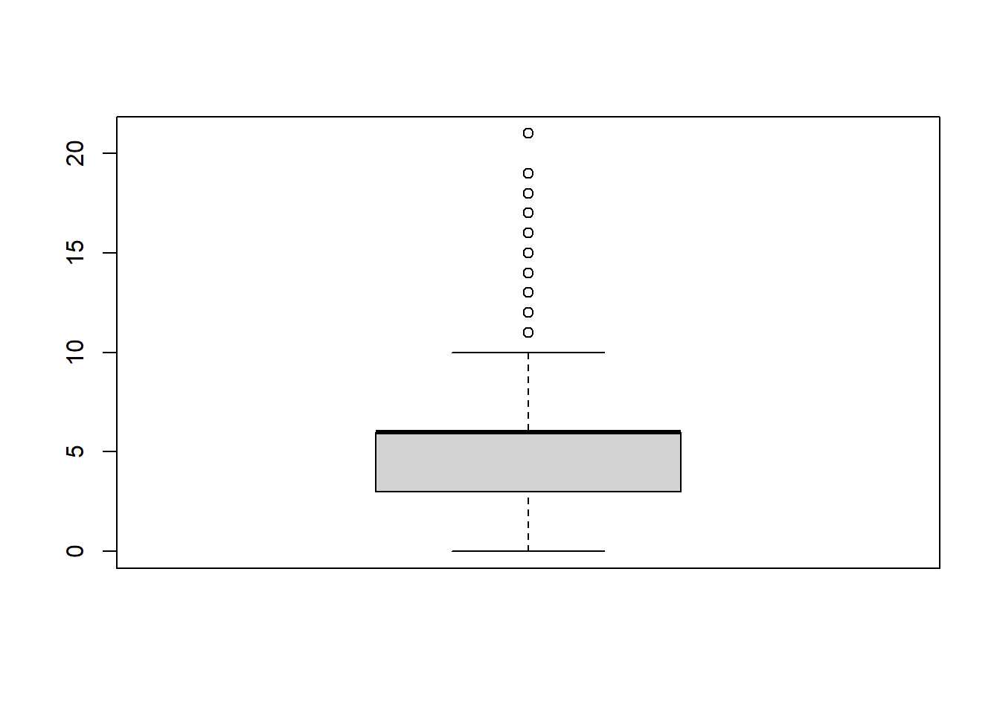


```r
#m_date <- m_date %>% select(-c('pdays3', 'pdays4'))
m_date[0:10,]
```

```
##    age          job  marital                   k default housing    loan
## 1   30  blue-collar  married            basic.9y      no     yes      no
## 2   39     services   single         high.school      no      no      no
## 3   25     services  married         high.school      no     yes      no
## 4   38     services  married            basic.9y      no unknown unknown
## 5   47       admin.  married   university.degree      no     yes      no
## 6   32     services   single   university.degree      no      no      no
## 7   32       admin.   single   university.degree      no     yes      no
## 8   41 entrepreneur  married   university.degree unknown     yes      no
## 9   31     services divorced professional.course      no      no      no
## 10  35  blue-collar  married            basic.9y unknown      no      no
##      contact month day_of_week duration campaign pdays previous    poutcome
## 1   cellular   may         fri      487        2   999        0 nonexistent
## 2  telephone   may         fri      346        4   999        0 nonexistent
## 3  telephone   jun         wed      227        1   999        0 nonexistent
## 4  telephone   jun         fri       17        3   999        0 nonexistent
## 5   cellular   nov         mon       58        1   999        0 nonexistent
## 6   cellular   sep         thu      128        3   999        2     failure
## 7   cellular   sep         mon      290        4   999        0 nonexistent
## 8   cellular   nov         mon       44        2   999        0 nonexistent
## 9   cellular   nov         tue       68        1   999        1     failure
## 10 telephone   may         thu      170        1   999        0 nonexistent
##    emp.var.rate cons.price.idx cons.conf.idx euribor3m nr.employed  y pdays5
## 1          -1.8         92.893         -46.2     1.313      5099.1 no     NA
## 2           1.1         93.994         -36.4     4.855      5191.0 no     NA
## 3           1.4         94.465         -41.8     4.962      5228.1 no     NA
## 4           1.4         94.465         -41.8     4.959      5228.1 no     NA
## 5          -0.1         93.200         -42.0     4.191      5195.8 no     NA
## 6          -1.1         94.199         -37.5     0.884      4963.6 no     NA
## 7          -1.1         94.199         -37.5     0.879      4963.6 no     NA
## 8          -0.1         93.200         -42.0     4.191      5195.8 no     NA
## 9          -0.1         93.200         -42.0     4.153      5195.8 no     NA
## 10          1.1         93.994         -36.4     4.855      5191.0 no     NA
```


```r
m_date$pdays5
```

```
##    [1] NA NA NA NA NA NA NA NA NA NA NA NA NA NA NA NA NA NA NA NA NA 12 NA NA
##   [25] NA NA NA NA NA NA NA NA NA NA NA NA NA NA NA NA NA NA NA NA NA NA NA NA
##   [49] NA NA NA NA NA  3 NA NA NA NA NA NA NA NA  6 NA NA NA NA NA  5 NA NA NA
##   [73] NA NA NA NA NA NA NA NA NA NA NA  2 NA NA NA NA NA NA NA NA NA NA NA NA
##   [97] NA NA NA NA NA NA NA NA NA NA NA NA NA NA NA NA NA NA NA NA NA NA NA NA
##  [121] NA NA NA NA NA NA NA NA NA NA NA NA NA NA NA NA NA NA NA NA NA NA NA  3
##  [145] NA NA NA NA NA NA  3 NA NA  6 NA NA NA NA NA NA NA NA NA NA NA  6 NA NA
##  [169] NA NA NA NA NA NA NA NA NA NA  3 NA NA NA NA NA NA NA NA  3 NA NA NA NA
##  [193] NA NA NA NA NA NA NA NA NA NA NA NA  6 NA NA NA NA NA NA NA NA NA NA NA
##  [217] NA NA NA NA NA NA NA NA NA NA NA NA  6 NA NA NA NA NA NA NA NA NA NA NA
##  [241] NA NA NA NA NA NA NA NA NA NA NA NA NA NA NA NA NA NA NA NA NA NA 10 NA
##  [265] NA NA NA NA NA NA NA NA NA NA NA NA NA NA NA NA NA NA NA NA NA NA NA NA
##  [289] NA NA NA NA  6 NA NA NA NA NA NA NA NA NA NA NA NA NA NA NA NA NA NA NA
##  [313] NA NA NA NA NA NA NA NA 11 NA NA NA NA NA NA NA NA NA NA NA NA NA NA NA
##  [337] NA NA NA NA  6 NA NA NA NA 10 NA NA NA NA NA NA NA NA NA NA NA NA NA NA
##  [361] NA NA NA NA NA NA NA NA NA NA NA NA NA NA NA NA NA NA NA NA NA  3 NA NA
##  [385] NA NA NA NA NA NA NA NA NA NA NA NA NA NA NA NA NA NA NA NA NA  2 NA NA
##  [409] NA NA NA NA NA NA NA NA NA NA NA NA  5 NA NA NA NA  3 NA NA NA NA NA NA
##  [433] NA NA NA NA NA NA NA NA NA NA NA NA NA NA NA NA  5 NA NA NA NA NA NA NA
##  [457] NA NA NA NA NA NA NA  7 NA NA NA NA NA NA NA NA NA NA NA NA NA  3 NA NA
##  [481] NA NA NA NA NA NA NA NA NA NA NA NA NA NA NA NA NA NA NA NA NA NA NA NA
##  [505] NA NA NA NA NA NA NA NA NA NA NA NA NA NA NA NA NA NA NA NA NA NA NA NA
##  [529] NA NA NA NA NA NA NA NA NA NA NA NA NA NA NA NA NA NA NA NA NA NA NA NA
##  [553] NA NA NA NA NA NA NA NA NA NA NA NA NA NA NA NA NA NA  6 NA NA NA NA NA
##  [577] NA NA NA NA NA NA NA NA NA NA NA NA NA  3 NA NA NA NA NA NA NA NA NA NA
##  [601] NA NA NA NA NA NA NA NA NA  7 NA NA NA NA NA NA NA NA NA  6 NA NA NA NA
##  [625] NA NA NA NA NA NA NA NA NA NA NA NA NA NA NA NA NA NA NA NA NA NA NA NA
##  [649] NA NA NA NA NA NA NA NA NA NA  6 NA NA NA NA NA NA NA NA NA NA NA NA NA
##  [673] NA  1 NA NA NA NA NA NA NA NA NA NA NA NA NA NA NA NA NA NA NA NA NA 18
##  [697]  7 NA NA NA NA NA NA NA NA  6 NA NA NA NA NA NA NA NA NA NA NA NA NA NA
##  [721] NA NA NA NA NA NA NA NA NA NA NA NA NA 12 NA NA NA NA NA NA NA NA NA NA
##  [745] NA NA NA NA NA NA NA NA NA NA NA NA NA NA NA NA NA NA NA NA NA NA NA NA
##  [769] NA NA NA NA  4 NA NA NA NA NA NA NA NA NA NA NA NA NA NA NA NA NA NA NA
##  [793] NA NA NA NA NA NA NA NA NA NA NA NA NA NA NA NA NA NA NA NA NA NA NA NA
##  [817] NA NA NA NA NA NA NA NA NA NA NA NA NA NA NA NA NA NA NA NA NA NA NA NA
##  [841] NA NA NA NA NA NA NA NA NA NA NA NA NA NA NA NA NA NA NA NA NA NA NA NA
##  [865] NA NA NA NA NA NA NA NA NA NA NA NA NA NA NA NA NA NA NA NA NA NA NA NA
##  [889] NA NA NA NA NA NA NA NA NA NA NA NA NA NA NA 12 NA NA NA NA NA NA NA 12
##  [913] NA NA NA NA NA NA NA NA NA NA NA NA NA NA NA NA NA NA NA NA NA NA NA NA
##  [937] NA NA NA NA NA NA NA NA NA NA NA  3 NA NA NA NA NA NA NA NA NA NA NA NA
##  [961] NA NA NA NA NA 15 NA NA NA NA NA NA NA NA NA NA NA NA NA NA NA NA NA NA
##  [985] NA NA NA NA NA NA NA NA NA NA  3 NA NA NA NA NA NA NA NA NA NA NA NA NA
## [1009] NA NA NA NA NA NA NA NA NA NA NA NA NA NA  1 NA NA NA NA NA NA NA NA NA
## [1033] NA NA NA NA NA NA NA NA NA NA NA NA NA NA  0 NA NA NA NA NA NA NA NA NA
## [1057] NA NA NA NA NA NA NA NA NA NA NA NA NA NA NA NA NA NA NA NA NA NA NA NA
## [1081] NA NA NA NA NA NA NA NA  3 NA NA NA NA NA NA NA 10 NA  3 NA NA NA NA NA
## [1105] NA NA NA NA NA NA NA NA NA NA NA  2 NA NA NA NA NA NA NA NA NA NA NA NA
## [1129] NA NA NA NA NA NA NA NA NA NA NA NA NA NA NA NA NA NA NA NA NA NA NA NA
## [1153] NA NA NA NA NA NA NA NA NA NA NA NA NA NA NA NA NA NA NA NA NA NA NA NA
## [1177] NA NA NA NA NA NA NA  6 NA NA NA NA NA NA NA NA NA NA NA NA NA NA NA NA
## [1201] NA NA NA NA NA NA NA NA NA NA NA NA NA NA NA NA NA NA NA NA NA NA NA NA
## [1225] NA NA NA NA NA NA NA NA NA NA  3 NA NA NA NA NA NA NA NA NA NA NA NA NA
## [1249] NA NA NA NA NA NA NA NA NA  6 NA NA  3 NA NA NA NA NA NA NA NA NA NA NA
## [1273]  7 NA NA NA NA NA NA NA NA NA NA NA NA NA NA NA NA NA NA NA NA NA NA NA
## [1297] NA NA  6 NA NA NA NA NA NA NA NA NA NA NA NA NA NA NA NA NA NA NA NA NA
## [1321] NA NA NA NA NA NA NA NA NA NA NA NA NA NA NA NA NA NA NA NA NA NA NA NA
## [1345] NA NA NA NA NA NA NA NA NA NA NA NA NA  6 NA NA NA NA NA NA NA NA NA NA
## [1369] NA NA NA NA NA NA NA NA NA NA NA NA NA NA NA NA NA NA NA NA NA  4 NA NA
## [1393] NA NA NA NA NA NA NA NA NA NA NA NA NA NA NA NA NA NA NA NA NA NA NA NA
## [1417] NA NA NA NA NA NA NA NA NA NA NA NA NA NA NA NA NA NA NA NA NA NA NA NA
## [1441] NA NA NA NA NA NA NA NA NA NA NA NA NA NA NA NA NA NA NA NA NA NA NA NA
## [1465]  3 NA NA NA NA NA NA NA NA NA NA NA NA NA NA NA NA NA NA NA NA  3 NA NA
## [1489] NA NA NA NA NA NA NA NA NA NA NA NA NA NA NA NA NA NA NA NA NA NA NA NA
## [1513] NA  3 NA NA NA NA NA NA NA NA NA NA NA NA NA NA NA NA NA NA NA NA NA NA
## [1537] NA NA NA NA NA NA NA NA NA NA NA NA NA NA NA NA NA NA NA NA NA NA NA NA
## [1561] NA NA NA NA NA NA NA NA NA NA NA NA NA NA NA NA  3 NA NA NA NA NA NA NA
## [1585] NA NA NA NA NA NA NA  3 NA NA NA NA NA NA NA NA NA NA NA NA NA NA NA NA
## [1609] NA  6 NA NA NA NA NA NA NA NA NA NA NA NA NA NA NA NA NA NA 18 NA NA NA
## [1633]  5 NA NA NA NA NA NA NA NA NA NA NA NA NA NA NA NA NA NA NA NA NA NA NA
## [1657] NA NA NA NA NA  7 NA NA NA NA NA NA NA NA NA NA NA NA NA NA NA NA NA NA
## [1681]  3 NA NA NA NA NA NA NA NA NA NA NA NA NA NA NA NA NA NA NA NA NA NA NA
## [1705] NA NA NA NA NA NA NA NA NA  6 NA NA NA NA NA NA NA NA NA NA NA NA NA NA
## [1729] NA NA NA NA NA NA NA NA NA NA NA NA NA NA NA NA NA  6 NA NA NA NA NA NA
## [1753] NA NA NA NA NA NA NA NA NA NA NA NA NA NA NA NA NA NA NA NA NA NA NA NA
## [1777] NA NA NA NA NA NA NA NA NA NA NA NA NA NA NA NA NA  3 NA NA NA NA NA NA
## [1801] NA NA NA NA NA NA NA NA NA NA NA NA NA NA NA NA NA NA NA NA NA NA NA NA
## [1825] NA NA NA NA NA NA NA NA NA NA NA NA NA  6 NA NA NA NA NA NA NA NA  4 NA
## [1849] NA NA  3 NA NA NA NA NA NA NA NA  3 NA NA 15 NA NA NA  3 NA NA NA NA 10
## [1873] NA NA NA NA NA NA NA NA NA NA NA NA NA NA NA NA NA NA NA NA NA NA NA NA
## [1897] NA NA NA NA NA NA NA NA NA NA NA NA NA NA NA NA NA NA NA NA NA NA NA NA
## [1921] NA NA NA NA NA NA NA NA NA NA NA NA  6 NA NA NA NA NA NA NA NA NA NA NA
## [1945] NA NA  7 NA NA NA NA NA NA NA NA NA NA NA NA NA NA NA NA NA NA NA NA NA
## [1969] NA NA NA NA NA NA NA NA NA NA NA NA NA NA NA NA NA NA NA NA NA NA NA NA
## [1993] NA NA NA NA NA NA NA NA NA NA NA NA NA NA NA NA NA NA NA NA NA NA NA NA
## [2017] NA NA  3 NA NA NA NA NA NA NA NA NA NA NA NA NA NA NA NA NA NA NA NA NA
## [2041] NA  4 NA NA NA NA NA NA NA NA NA NA NA NA NA NA NA NA NA NA NA NA NA NA
## [2065] NA NA NA NA NA NA NA NA NA NA NA NA NA NA NA NA NA NA NA NA NA NA NA NA
## [2089] NA NA NA  4 NA NA NA NA NA NA NA NA NA NA  3 NA NA NA NA NA NA NA NA NA
## [2113] NA NA NA NA NA 10 NA NA NA NA  3 NA NA NA NA NA NA NA NA NA NA NA NA NA
## [2137] NA NA  3  3 NA NA NA NA NA NA NA NA NA NA NA NA NA NA NA NA NA NA NA NA
## [2161] NA NA  3 NA NA NA NA NA NA NA NA NA NA NA NA NA NA NA NA NA NA NA NA NA
## [2185] NA NA NA  6 NA NA NA NA NA NA NA NA NA NA NA NA NA NA NA NA NA NA NA NA
## [2209] NA NA NA  3 NA NA NA NA NA NA NA NA NA NA NA NA NA NA NA NA NA NA NA NA
## [2233] NA NA NA NA NA NA NA NA NA NA NA NA NA NA NA NA NA NA NA NA NA NA NA NA
## [2257] NA NA NA NA NA NA NA  6 NA NA NA NA NA NA NA NA  4 NA NA NA NA NA NA NA
## [2281] NA NA NA NA NA NA NA NA NA NA NA NA NA NA  6 NA NA NA NA NA NA NA NA NA
## [2305] NA NA NA NA NA NA NA NA NA NA NA NA NA NA NA NA NA NA NA NA NA NA NA NA
## [2329] NA NA NA NA NA NA NA NA NA NA NA NA NA NA NA NA NA NA NA NA NA NA NA NA
## [2353] NA NA NA NA NA NA NA NA NA NA NA NA NA NA NA NA NA NA NA NA NA  3 NA NA
## [2377] NA NA NA NA NA NA NA NA NA NA NA NA NA NA NA NA NA NA NA NA NA NA NA NA
## [2401] NA NA NA NA NA NA NA NA NA NA NA NA NA NA NA NA NA NA NA NA NA NA NA NA
## [2425] NA NA NA NA NA NA NA  3 NA  4 NA NA NA NA NA NA NA NA NA NA NA NA NA NA
## [2449] NA NA NA NA NA NA NA NA NA NA NA NA NA NA NA NA NA NA NA NA NA NA NA NA
## [2473] NA NA NA NA NA NA NA NA  6 NA NA NA NA NA NA NA  6 NA NA NA NA NA NA NA
## [2497] NA NA NA NA NA NA NA NA NA NA NA NA NA NA NA NA NA NA NA NA NA NA NA NA
## [2521] NA NA NA NA NA NA NA NA NA NA NA NA NA NA NA NA NA NA NA NA NA NA NA NA
## [2545] NA NA NA NA NA NA NA NA NA NA  6 NA NA NA NA NA NA NA NA NA NA NA NA NA
## [2569] NA NA NA NA NA NA NA  4 NA NA NA NA NA NA NA NA NA NA NA NA NA NA NA NA
## [2593] NA  3 NA NA NA NA NA NA NA NA NA  6 NA NA NA NA NA NA NA NA NA NA NA NA
## [2617]  7 NA NA NA NA NA NA NA NA NA NA NA NA NA NA NA NA NA NA NA NA NA NA NA
## [2641] NA NA NA NA NA NA NA NA NA NA NA NA NA NA NA NA NA NA NA NA NA  4 NA NA
## [2665] NA NA NA NA NA NA NA NA NA NA NA NA NA NA NA NA NA NA NA NA NA NA NA NA
## [2689] NA NA NA NA NA NA NA NA NA NA NA NA NA NA NA NA NA NA NA NA NA  3 NA NA
## [2713] NA NA NA NA NA NA NA NA NA NA NA NA NA NA NA NA NA NA NA NA NA NA NA NA
## [2737] NA NA NA NA NA NA NA NA NA NA NA NA NA NA NA NA NA NA NA NA NA NA NA NA
## [2761] NA NA NA NA NA NA NA NA NA NA NA NA NA NA NA NA NA NA NA NA NA NA NA NA
## [2785] NA NA NA NA NA NA NA NA 16 NA NA NA NA NA NA NA NA NA NA NA NA NA NA NA
## [2809] NA NA NA NA NA NA NA NA NA NA NA  3 NA NA NA NA NA NA NA NA NA NA NA NA
## [2833] NA NA NA NA NA NA NA NA NA NA NA NA NA NA NA NA NA NA  9 NA NA NA NA NA
## [2857] NA  3 NA NA NA NA  3 NA NA NA NA NA NA NA NA NA NA NA NA NA NA NA NA NA
## [2881] NA NA NA NA NA NA NA NA NA NA NA  6 NA NA NA NA NA NA NA NA NA NA NA NA
## [2905] NA NA NA NA NA NA NA NA  4 NA NA NA NA NA NA NA NA NA NA NA NA NA NA NA
## [2929] NA NA NA  7 NA NA NA NA NA NA NA NA NA NA NA NA NA NA NA NA NA NA NA NA
## [2953] NA NA NA NA NA NA NA NA NA NA NA NA NA NA NA NA NA NA NA NA NA NA NA NA
## [2977] NA NA NA NA NA NA NA NA NA NA NA NA NA NA NA NA NA NA NA NA NA NA NA NA
## [3001] NA NA NA NA NA NA NA NA NA NA NA NA NA NA NA NA NA NA NA NA NA NA NA NA
## [3025] NA NA NA NA NA NA NA NA NA NA NA NA NA NA NA NA NA NA  6 NA NA NA NA NA
## [3049] NA  6 NA NA NA NA NA NA NA NA NA NA NA NA NA NA NA NA NA NA NA NA NA NA
## [3073] NA NA NA NA NA NA NA NA NA NA NA NA NA NA  6 NA NA NA NA NA NA NA NA NA
## [3097] NA NA NA NA NA NA NA NA NA NA 10 19 NA NA NA NA  3 NA NA NA NA NA NA NA
## [3121] NA NA NA NA NA NA NA  0 NA NA NA NA NA NA NA NA NA NA NA NA NA NA NA NA
## [3145] NA NA NA NA NA NA NA  4 NA NA NA NA NA NA NA NA NA NA NA NA NA NA NA NA
## [3169] NA NA NA NA NA NA NA NA NA NA NA  7 NA NA NA NA NA NA NA  6 NA NA NA NA
## [3193] NA NA NA NA NA NA NA NA NA NA NA NA NA NA NA NA NA NA  6 NA NA NA NA NA
## [3217]  3 NA NA NA NA NA NA NA NA NA NA NA NA NA NA NA NA NA NA NA NA NA  6 NA
## [3241] NA NA NA  7 NA NA NA NA NA NA NA NA NA NA NA NA NA NA NA NA NA NA NA NA
## [3265] NA NA NA NA NA NA NA NA NA NA NA NA NA NA NA NA NA NA NA NA NA NA NA NA
## [3289] NA NA NA NA NA NA NA NA  6 NA NA NA NA NA NA NA NA NA NA NA NA NA NA NA
## [3313] NA NA NA NA NA NA NA NA NA NA NA NA NA NA NA NA NA 16 NA NA NA NA NA NA
## [3337] NA NA NA NA  6 NA NA NA NA NA NA NA NA NA NA NA NA NA NA NA NA NA NA NA
## [3361] NA NA NA NA  6 NA NA NA NA NA NA NA NA NA NA NA NA NA NA NA NA NA NA NA
## [3385] NA NA  4 NA NA NA NA NA NA NA NA NA NA NA NA NA NA NA 17 NA NA NA NA NA
## [3409] NA NA NA NA NA NA NA NA NA NA NA NA NA NA NA NA NA NA NA NA NA NA NA NA
## [3433] NA NA NA NA  9 NA NA NA NA NA  6 NA NA NA NA NA NA NA NA NA NA NA NA  3
## [3457] NA NA NA NA NA NA NA NA NA NA NA NA NA NA NA NA NA NA NA NA NA NA NA NA
## [3481] NA NA NA NA NA NA NA NA NA NA NA NA NA NA NA NA NA NA NA NA NA NA 13 NA
## [3505] NA NA NA NA NA NA NA NA NA NA NA NA NA NA NA 10 NA NA NA NA NA NA 21 NA
## [3529] NA NA NA NA NA NA NA NA NA NA NA NA NA NA NA NA NA NA NA  3 NA NA NA NA
## [3553] NA NA NA NA NA NA NA NA NA NA NA NA NA  6 NA NA NA NA NA NA NA NA NA NA
## [3577] NA NA NA NA  3 NA NA NA NA NA NA NA NA NA NA NA NA NA  6 NA NA NA NA NA
## [3601] NA NA NA NA NA NA NA NA NA NA NA NA NA NA NA NA NA 10 NA NA NA NA NA NA
## [3625] NA NA NA NA NA NA NA NA NA NA NA NA NA NA NA NA NA NA NA NA NA NA NA NA
## [3649]  3 NA NA NA NA NA NA NA NA NA NA NA NA NA  9 NA NA  1 NA NA NA NA NA NA
## [3673] NA NA NA NA NA NA NA NA NA NA NA NA NA NA NA NA NA NA NA NA NA NA NA NA
## [3697] NA NA NA NA NA NA NA  3 NA NA NA  6 NA NA NA NA NA NA NA NA NA NA NA NA
## [3721] NA NA NA NA NA NA NA NA NA NA NA NA NA NA NA NA NA NA NA NA NA NA NA NA
## [3745] NA NA NA NA NA NA NA NA NA NA NA NA NA  2 NA NA NA NA NA NA NA NA NA NA
## [3769] NA NA NA NA NA NA NA NA NA NA NA NA NA NA NA NA NA NA NA NA NA NA NA NA
## [3793] NA  3 NA NA NA NA NA NA NA NA NA NA NA NA NA NA NA NA  3 NA NA 12 NA NA
## [3817] NA NA NA NA NA NA NA  3 NA NA NA NA NA NA NA NA NA NA NA NA NA NA NA NA
## [3841] NA NA NA NA NA NA NA NA NA NA NA NA NA NA NA NA NA NA NA NA NA NA  3  4
## [3865] NA NA NA NA NA NA NA NA NA NA NA NA NA NA NA  3 NA NA NA NA NA NA NA NA
## [3889] NA NA NA NA NA NA NA NA NA NA NA NA NA NA NA NA NA NA NA NA NA NA NA NA
## [3913] NA NA NA NA NA NA NA NA NA NA NA NA NA NA NA NA NA NA NA NA NA NA NA NA
## [3937] NA NA NA NA NA NA NA NA NA NA NA NA NA NA NA NA NA NA NA NA NA NA NA NA
## [3961] NA NA NA NA NA NA NA NA NA NA NA NA NA NA NA NA NA NA NA NA NA NA NA 13
## [3985] NA NA NA NA NA NA NA NA NA NA NA NA NA NA NA NA NA NA NA NA NA NA NA NA
## [4009] NA NA NA NA NA NA  4 NA NA NA NA NA NA NA NA NA NA NA NA NA NA NA NA NA
## [4033] NA NA NA NA NA NA NA NA NA NA NA NA NA NA NA NA NA NA NA NA NA NA NA NA
## [4057] NA NA NA NA NA NA NA NA NA NA NA NA NA NA NA 14 NA NA NA NA NA NA NA NA
## [4081] NA NA NA NA NA NA NA NA  3 NA NA NA NA NA  6 NA NA NA NA NA
```


```r
boxplot(m_date$pdays5)
```


```r
hist(m_date$pdays5)
```

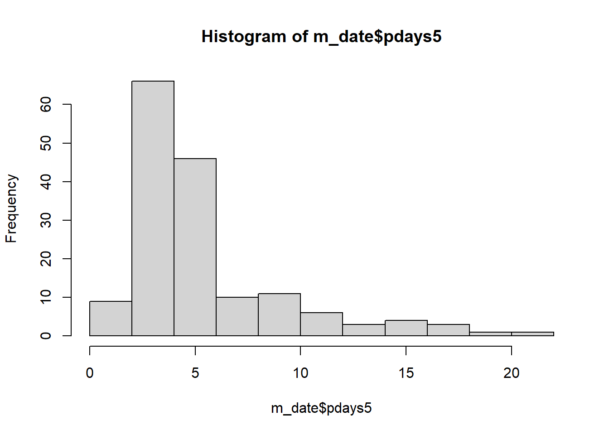

```r
summary(m_date$pdays5)
```

```
##    Min. 1st Qu.  Median    Mean 3rd Qu.    Max.    NA's 
##   0.000   3.000   6.000   5.862   6.000  21.000    3940
```


```r
boxplot(m_date$duration)
```


```r
boxplot(m_date$previous)
```

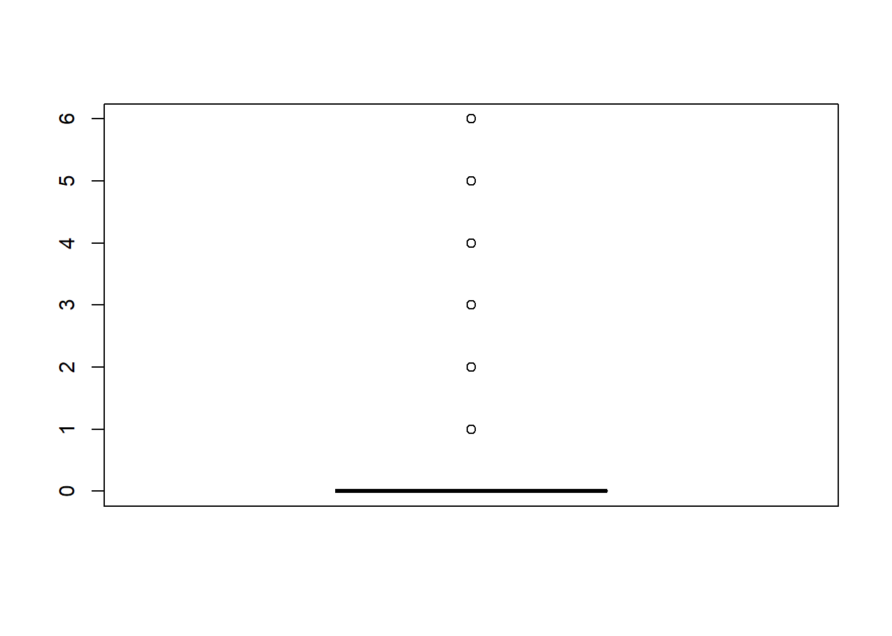

```r
boxplot(m_date$cons.conf.idx)
```

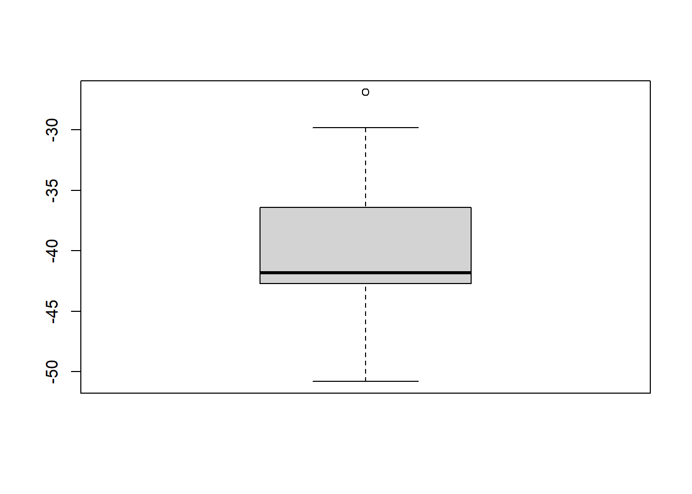

```r
boxplot(m_date$euribor3m)
```

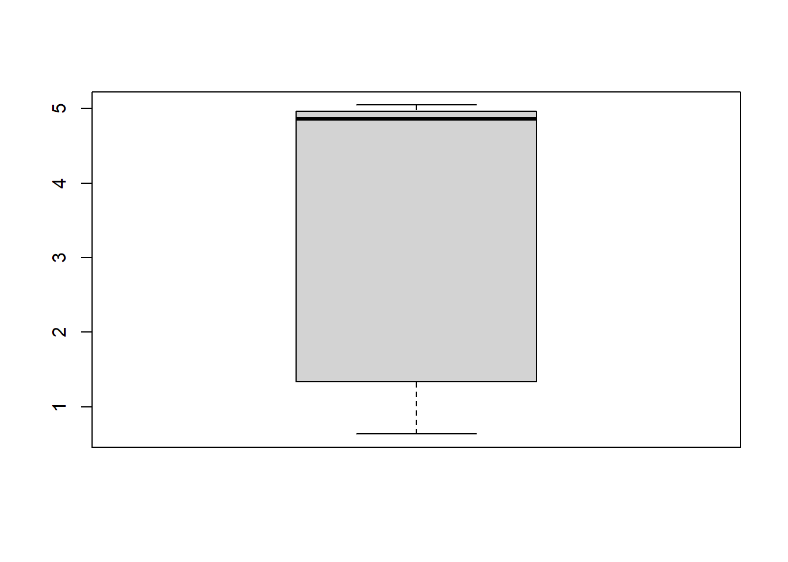

```r
boxplot(m_date$nr.employed)
```

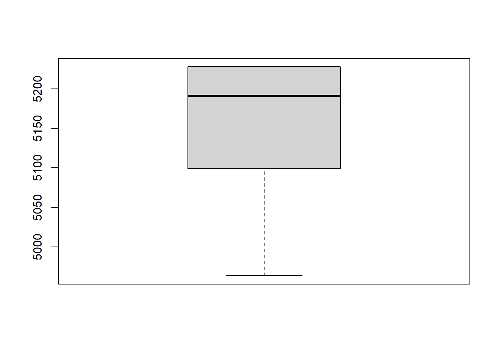

```r
hist(m_date$previous)
```

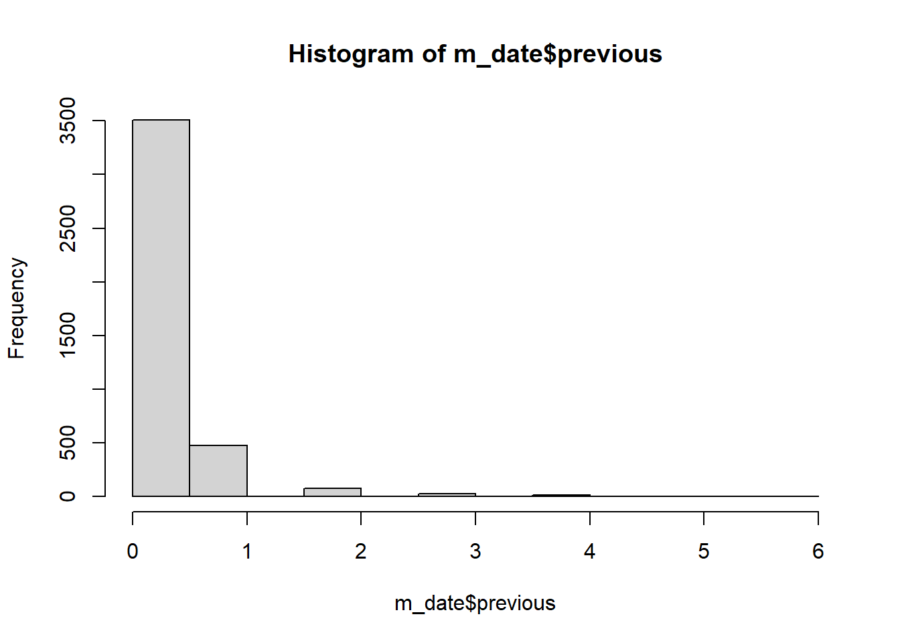


## Summarising Data


```r
#Numeric values statistics
m_date %>% summarize_if(is.numeric, mean)
```

```
##        age duration campaign    pdays  previous emp.var.rate cons.price.idx
## 1 40.11707 256.7546 2.538537 960.2434 0.1907317   0.08517073       93.58012
##   cons.conf.idx euribor3m nr.employed pdays5
## 1     -40.49846  3.621421    5166.473     NA
```
## Converting string variables to levels


```r
m_date$job <- as.factor(m_date$job)
m_date$marital <- as.factor(m_date$marital)
m_date$k <- as.factor(m_date$k)
m_date$default <- as.factor(m_date$default)
m_date$housing <- as.factor(m_date$housing)
m_date$loan <- as.factor(m_date$loan)
m_date$contact <- as.factor(m_date$contact)
m_date$month <- as.factor(m_date$month)
m_date$day_of_week <- as.factor(m_date$day_of_week)
m_date$day_of_week <- as.factor(m_date$day_of_week)
m_date$poutcome <- as.factor(m_date$poutcome)
m_date$y <- as.factor(m_date$y)
m_date$pdays2 <- as.factor(m_date$pdays)
```

### Preview of the dataset after conversion


```r
str(m_date)
```

```
## 'data.frame':	4100 obs. of  23 variables:
##  $ age           : int  30 39 25 38 47 32 32 41 31 35 ...
##  $ job           : Factor w/ 12 levels "admin.","blue-collar",..: 2 8 8 8 1 8 1 3 8 2 ...
##  $ marital       : Factor w/ 4 levels "divorced","married",..: 2 3 2 2 2 3 3 2 1 2 ...
##  $ k             : Factor w/ 8 levels "basic.4y","basic.6y",..: 3 4 4 3 7 7 7 7 6 3 ...
##  $ default       : Factor w/ 3 levels "no","unknown",..: 1 1 1 1 1 1 1 2 1 2 ...
##  $ housing       : Factor w/ 3 levels "no","unknown",..: 3 1 3 2 3 1 3 3 1 1 ...
##  $ loan          : Factor w/ 3 levels "no","unknown",..: 1 1 1 2 1 1 1 1 1 1 ...
##  $ contact       : Factor w/ 2 levels "cellular","telephone": 1 2 2 2 1 1 1 1 1 2 ...
##  $ month         : Factor w/ 10 levels "apr","aug","dec",..: 7 7 5 5 8 10 10 8 8 7 ...
##  $ day_of_week   : Factor w/ 5 levels "fri","mon","thu",..: 1 1 5 1 2 3 2 2 4 3 ...
##  $ duration      : int  487 346 227 17 58 128 290 44 68 170 ...
##  $ campaign      : int  2 4 1 3 1 3 4 2 1 1 ...
##  $ pdays         : int  999 999 999 999 999 999 999 999 999 999 ...
##  $ previous      : int  0 0 0 0 0 2 0 0 1 0 ...
##  $ poutcome      : Factor w/ 3 levels "failure","nonexistent",..: 2 2 2 2 2 1 2 2 1 2 ...
##  $ emp.var.rate  : num  -1.8 1.1 1.4 1.4 -0.1 -1.1 -1.1 -0.1 -0.1 1.1 ...
##  $ cons.price.idx: num  92.9 94 94.5 94.5 93.2 ...
##  $ cons.conf.idx : num  -46.2 -36.4 -41.8 -41.8 -42 -37.5 -37.5 -42 -42 -36.4 ...
##  $ euribor3m     : num  1.31 4.86 4.96 4.96 4.19 ...
##  $ nr.employed   : num  5099 5191 5228 5228 5196 ...
##  $ y             : Factor w/ 2 levels "no","yes": 1 1 1 1 1 1 1 1 1 1 ...
##  $ pdays5        : num  NA NA NA NA NA NA NA NA NA NA ...
##  $ pdays2        : Factor w/ 21 levels "0","1","2","3",..: 21 21 21 21 21 21 21 21 21 21 ...
```
#Checking for relation between age and duration

```r
plot(age ~ duration, data = m_date, col = "dodgerblue", pch = 20, cex = 1.5,
main = "age vs duration")
```


```r
pairs(m_date)
```

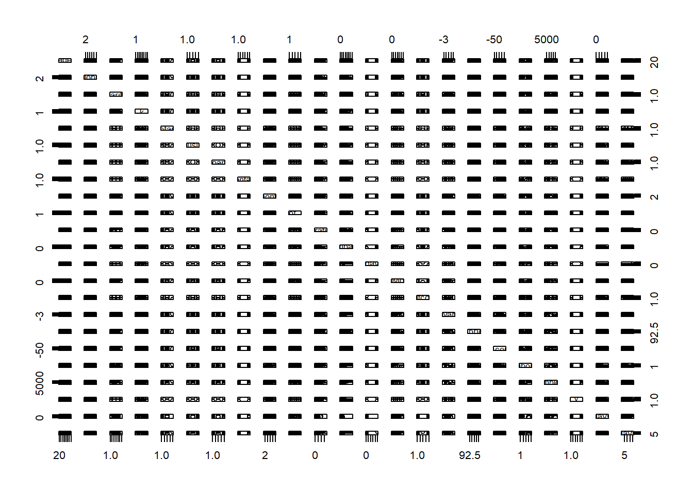


```r
 ggplot(m_date, mapping=(aes(y=job,fill=job))) + geom_bar() 
```

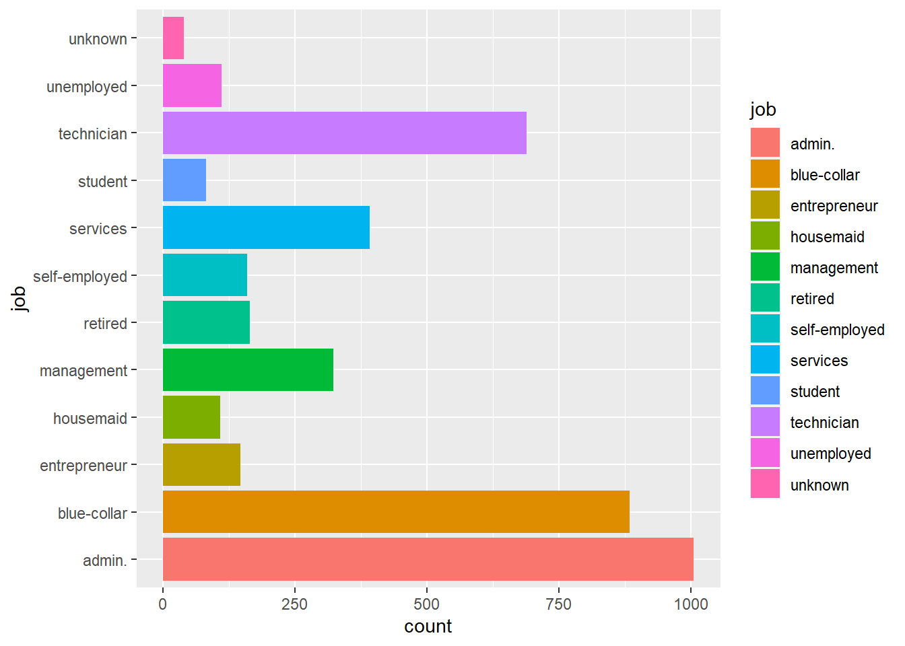

```r
 ggplot(m_date, mapping=(aes(x=marital,fill=marital))) + geom_bar() 
```


```r
ggplot(m_date, mapping=(aes(y=k,fill=k))) + geom_bar() 
```

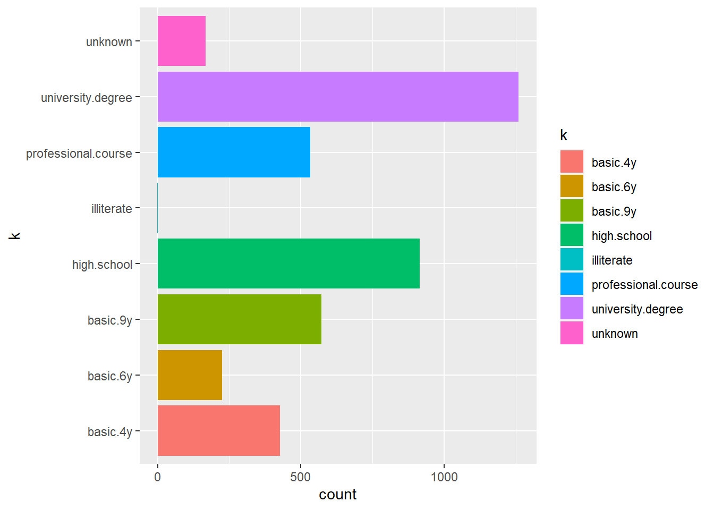

```r
m_date %>%  summarise_at(c("age"),sd)
```

```
##        age
## 1 10.31518
```


```r
view(m_date)
```

### more descriptive statisticis

```r
sapply(m_date, summary)
```

```
## $age
##    Min. 1st Qu.  Median    Mean 3rd Qu.    Max. 
##   18.00   32.00   38.00   40.12   47.00   88.00 
## 
## $job
##        admin.   blue-collar  entrepreneur     housemaid    management 
##          1005           883           146           108           323 
##       retired self-employed      services       student    technician 
##           165           159           392            81           688 
##    unemployed       unknown 
##           111            39 
## 
## $marital
## divorced  married   single  unknown 
##      442     2500     1147       11 
## 
## $k
##            basic.4y            basic.6y            basic.9y         high.school 
##                 428                 226                 572                 914 
##          illiterate professional.course   university.degree             unknown 
##                   1                 533                1259                 167 
## 
## $default
##      no unknown     yes 
##    3300     799       1 
## 
## $housing
##      no unknown     yes 
##    1832     104    2164 
## 
## $loan
##      no unknown     yes 
##    3334     104     662 
## 
## $contact
##  cellular telephone 
##      2639      1461 
## 
## $month
##  apr  aug  dec  jul  jun  mar  may  nov  oct  sep 
##  214  633   22  707  528   48 1373  443   68   64 
## 
## $day_of_week
## fri mon thu tue wed 
## 762 851 856 839 792 
## 
## $duration
##    Min. 1st Qu.  Median    Mean 3rd Qu.    Max. 
##     0.0   103.0   181.0   256.8   317.0  3643.0 
## 
## $campaign
##    Min. 1st Qu.  Median    Mean 3rd Qu.    Max. 
##   1.000   1.000   2.000   2.539   3.000  35.000 
## 
## $pdays
##    Min. 1st Qu.  Median    Mean 3rd Qu.    Max. 
##     0.0   999.0   999.0   960.2   999.0   999.0 
## 
## $previous
##    Min. 1st Qu.  Median    Mean 3rd Qu.    Max. 
##  0.0000  0.0000  0.0000  0.1907  0.0000  6.0000 
## 
## $poutcome
##     failure nonexistent     success 
##         452        3506         142 
## 
## $emp.var.rate
##     Min.  1st Qu.   Median     Mean  3rd Qu.     Max. 
## -3.40000 -1.80000  1.10000  0.08517  1.40000  1.40000 
## 
## $cons.price.idx
##    Min. 1st Qu.  Median    Mean 3rd Qu.    Max. 
##   92.20   93.08   93.75   93.58   93.99   94.77 
## 
## $cons.conf.idx
##    Min. 1st Qu.  Median    Mean 3rd Qu.    Max. 
##   -50.8   -42.7   -41.8   -40.5   -36.4   -26.9 
## 
## $euribor3m
##    Min. 1st Qu.  Median    Mean 3rd Qu.    Max. 
##   0.635   1.334   4.857   3.621   4.961   5.045 
## 
## $nr.employed
##    Min. 1st Qu.  Median    Mean 3rd Qu.    Max. 
##    4964    5099    5191    5166    5228    5228 
## 
## $y
##   no  yes 
## 3649  451 
## 
## $pdays5
##    Min. 1st Qu.  Median    Mean 3rd Qu.    Max.    NA's 
##   0.000   3.000   6.000   5.862   6.000  21.000    3940 
## 
## $pdays2
##    0    1    2    3    4    5    6    7    9   10   11   12   13   14   15   16 
##    2    3    4   52   14    4   42   10    3    8    1    5    2    1    2    2 
##   17   18   19   21  999 
##    1    2    1    1 3940
```

### summarising data usingthe purr library

```r
library(purrr)

m_date %>%  map(~summary(.))
```

```
## $age
##    Min. 1st Qu.  Median    Mean 3rd Qu.    Max. 
##   18.00   32.00   38.00   40.12   47.00   88.00 
## 
## $job
##        admin.   blue-collar  entrepreneur     housemaid    management 
##          1005           883           146           108           323 
##       retired self-employed      services       student    technician 
##           165           159           392            81           688 
##    unemployed       unknown 
##           111            39 
## 
## $marital
## divorced  married   single  unknown 
##      442     2500     1147       11 
## 
## $k
##            basic.4y            basic.6y            basic.9y         high.school 
##                 428                 226                 572                 914 
##          illiterate professional.course   university.degree             unknown 
##                   1                 533                1259                 167 
## 
## $default
##      no unknown     yes 
##    3300     799       1 
## 
## $housing
##      no unknown     yes 
##    1832     104    2164 
## 
## $loan
##      no unknown     yes 
##    3334     104     662 
## 
## $contact
##  cellular telephone 
##      2639      1461 
## 
## $month
##  apr  aug  dec  jul  jun  mar  may  nov  oct  sep 
##  214  633   22  707  528   48 1373  443   68   64 
## 
## $day_of_week
## fri mon thu tue wed 
## 762 851 856 839 792 
## 
## $duration
##    Min. 1st Qu.  Median    Mean 3rd Qu.    Max. 
##     0.0   103.0   181.0   256.8   317.0  3643.0 
## 
## $campaign
##    Min. 1st Qu.  Median    Mean 3rd Qu.    Max. 
##   1.000   1.000   2.000   2.539   3.000  35.000 
## 
## $pdays
##    Min. 1st Qu.  Median    Mean 3rd Qu.    Max. 
##     0.0   999.0   999.0   960.2   999.0   999.0 
## 
## $previous
##    Min. 1st Qu.  Median    Mean 3rd Qu.    Max. 
##  0.0000  0.0000  0.0000  0.1907  0.0000  6.0000 
## 
## $poutcome
##     failure nonexistent     success 
##         452        3506         142 
## 
## $emp.var.rate
##     Min.  1st Qu.   Median     Mean  3rd Qu.     Max. 
## -3.40000 -1.80000  1.10000  0.08517  1.40000  1.40000 
## 
## $cons.price.idx
##    Min. 1st Qu.  Median    Mean 3rd Qu.    Max. 
##   92.20   93.08   93.75   93.58   93.99   94.77 
## 
## $cons.conf.idx
##    Min. 1st Qu.  Median    Mean 3rd Qu.    Max. 
##   -50.8   -42.7   -41.8   -40.5   -36.4   -26.9 
## 
## $euribor3m
##    Min. 1st Qu.  Median    Mean 3rd Qu.    Max. 
##   0.635   1.334   4.857   3.621   4.961   5.045 
## 
## $nr.employed
##    Min. 1st Qu.  Median    Mean 3rd Qu.    Max. 
##    4964    5099    5191    5166    5228    5228 
## 
## $y
##   no  yes 
## 3649  451 
## 
## $pdays5
##    Min. 1st Qu.  Median    Mean 3rd Qu.    Max.    NA's 
##   0.000   3.000   6.000   5.862   6.000  21.000    3940 
## 
## $pdays2
##    0    1    2    3    4    5    6    7    9   10   11   12   13   14   15   16 
##    2    3    4   52   14    4   42   10    3    8    1    5    2    1    2    2 
##   17   18   19   21  999 
##    1    2    1    1 3940
```
### more descriptive stats

```r
x <- is.numeric(m_date)
view(x)
#summary(m_date[])
```
### descriptive for only numeric variables

```r
m_date_numeric <- select_if(m_date, is.numeric)  
summary(m_date_numeric)
```

```
##       age           duration         campaign          pdays      
##  Min.   :18.00   Min.   :   0.0   Min.   : 1.000   Min.   :  0.0  
##  1st Qu.:32.00   1st Qu.: 103.0   1st Qu.: 1.000   1st Qu.:999.0  
##  Median :38.00   Median : 181.0   Median : 2.000   Median :999.0  
##  Mean   :40.12   Mean   : 256.8   Mean   : 2.539   Mean   :960.2  
##  3rd Qu.:47.00   3rd Qu.: 317.0   3rd Qu.: 3.000   3rd Qu.:999.0  
##  Max.   :88.00   Max.   :3643.0   Max.   :35.000   Max.   :999.0  
##                                                                   
##     previous       emp.var.rate      cons.price.idx  cons.conf.idx  
##  Min.   :0.0000   Min.   :-3.40000   Min.   :92.20   Min.   :-50.8  
##  1st Qu.:0.0000   1st Qu.:-1.80000   1st Qu.:93.08   1st Qu.:-42.7  
##  Median :0.0000   Median : 1.10000   Median :93.75   Median :-41.8  
##  Mean   :0.1907   Mean   : 0.08517   Mean   :93.58   Mean   :-40.5  
##  3rd Qu.:0.0000   3rd Qu.: 1.40000   3rd Qu.:93.99   3rd Qu.:-36.4  
##  Max.   :6.0000   Max.   : 1.40000   Max.   :94.77   Max.   :-26.9  
##                                                                     
##    euribor3m      nr.employed       pdays5      
##  Min.   :0.635   Min.   :4964   Min.   : 0.000  
##  1st Qu.:1.334   1st Qu.:5099   1st Qu.: 3.000  
##  Median :4.857   Median :5191   Median : 6.000  
##  Mean   :3.621   Mean   :5166   Mean   : 5.862  
##  3rd Qu.:4.961   3rd Qu.:5228   3rd Qu.: 6.000  
##  Max.   :5.045   Max.   :5228   Max.   :21.000  
##                                 NA's   :3940
```

### descriptive for categorical variables


```r
m_date_categorical <- select_if(m_date, is.factor) 
summary(m_date_categorical)
```

```
##           job           marital                       k           default    
##  admin.     :1005   divorced: 442   university.degree  :1259   no     :3300  
##  blue-collar: 883   married :2500   high.school        : 914   unknown: 799  
##  technician : 688   single  :1147   basic.9y           : 572   yes    :   1  
##  services   : 392   unknown :  11   professional.course: 533                 
##  management : 323                   basic.4y           : 428                 
##  retired    : 165                   basic.6y           : 226                 
##  (Other)    : 644                   (Other)            : 168                 
##     housing          loan           contact         month      day_of_week
##  no     :1832   no     :3334   cellular :2639   may    :1373   fri:762    
##  unknown: 104   unknown: 104   telephone:1461   jul    : 707   mon:851    
##  yes    :2164   yes    : 662                    aug    : 633   thu:856    
##                                                 jun    : 528   tue:839    
##                                                 nov    : 443   wed:792    
##                                                 apr    : 214              
##                                                 (Other): 202              
##         poutcome      y            pdays2    
##  failure    : 452   no :3649   999    :3940  
##  nonexistent:3506   yes: 451   3      :  52  
##  success    : 142              6      :  42  
##                                4      :  14  
##                                7      :  10  
##                                10     :   8  
##                                (Other):  34
```


```r
plot(m_date_categorical$marital)
```

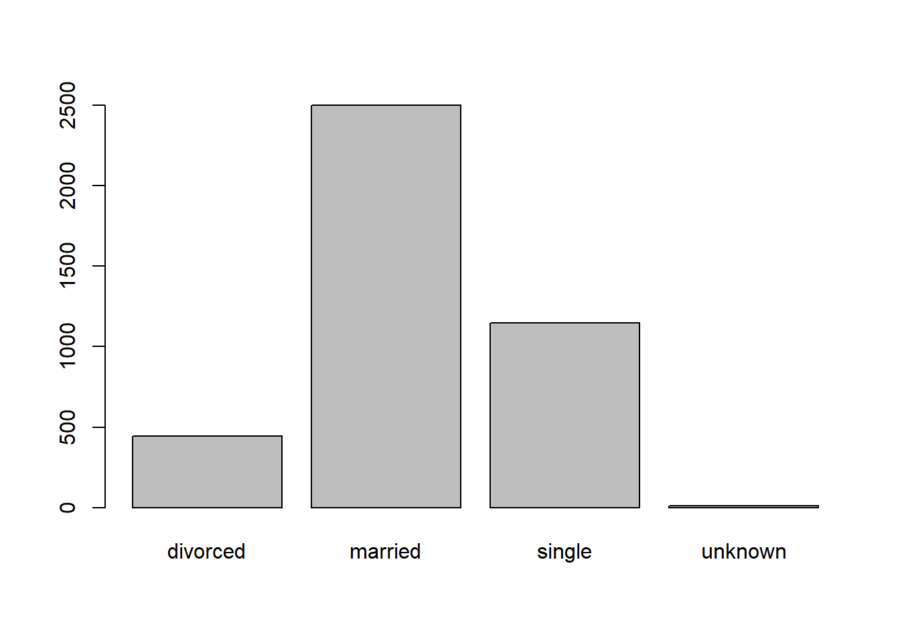

```r
plot(m_date_categorical$day_of_week)
```

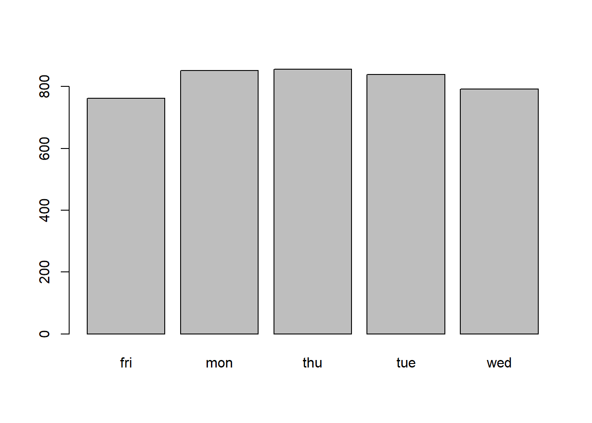


```r
plot(m_date$y)
```

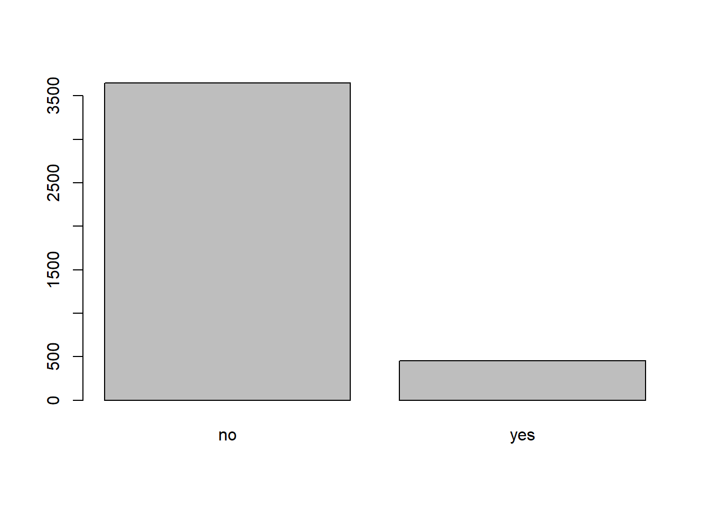

